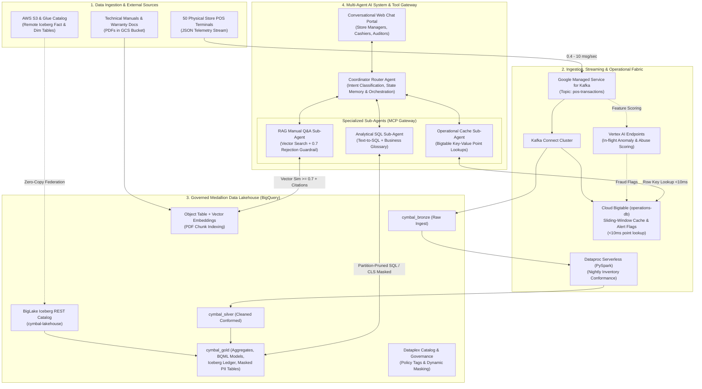
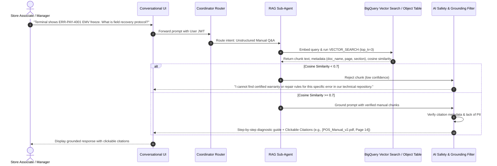
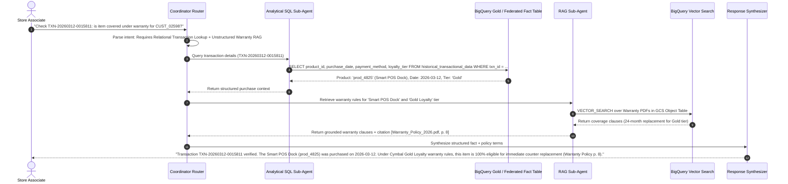
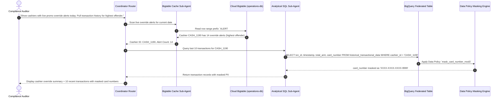
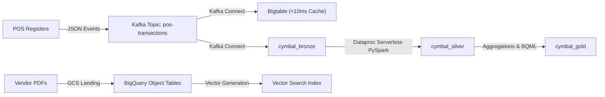
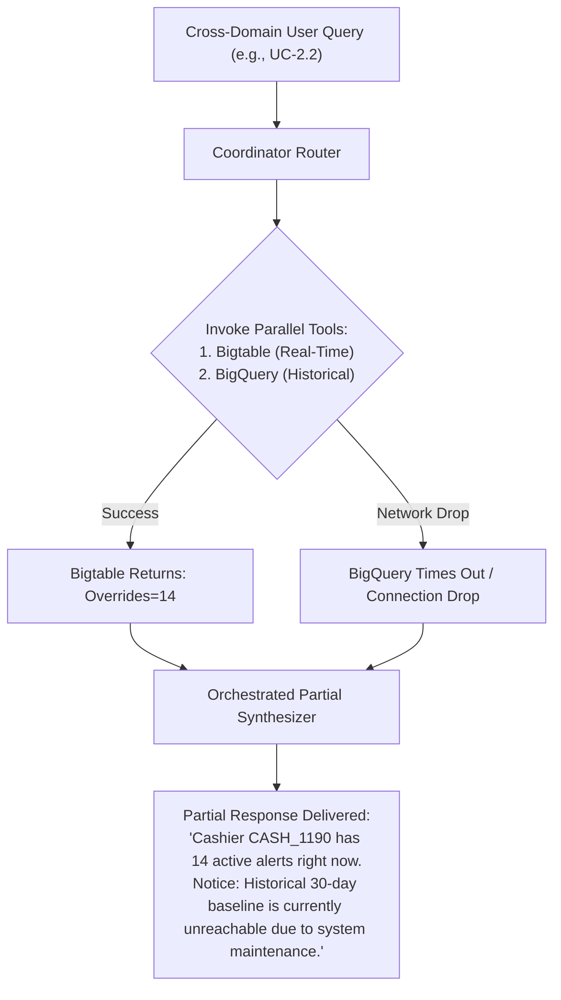

# **SOLUTION DESIGN DOCUMENT — CYMBAL RETAIL**

# **Document Control**

## **Document Metadata**

| Field | Value |
| :---- | :---- |
| Author(s) | Sarath P V (vanchee) / Google Cloud Solution Team |
| Date | September 8, 2026 |
| Status | Approved (Ready for Evaluation) |
| Target Audience | Evaluation Committee, Enterprise Lead Architects, CIO, VP of Data & AI |

## **Revision History**

| Version | Date | Author | Description of Change |
| :---- | :---- | :---- | :---- |
| 0.1 | 2026-09-08 | Lead Architect | Initial solution design outline & scope mapping |
| 1.0 | 2026-09-08 | Enterprise Solution Team | Complete end-to-end SDD across Lakehouse Federation, Streaming Intelligence, Multi-Agent System, Governance & FinOps |

---

# **1. Problem Statement & Scope Boundaries**

## **1.1. Problem Statement**

### **What problem are we solving?**
Cymbal Retail operates 500+ physical electronics storefronts and a global e-commerce portal. The existing data platform is anchored on AWS S3 and Databricks Spark clusters, facing critical operational and architectural bottlenecks:
1. **Escalating Cross-Cloud Data Egress & Silos**: Inability to query data in-place without costly data replication across clouds and environments.
2. **High Spark Cluster Tax & Management Overhead**: 24/7 cluster uptime and idle clusters during off-peak hours generate high Databricks Unit (DBU) and EC2 costs.
3. **24-Hour Batch Reporting Latencies**: Inventory stock counts and POS fraud alerts are delayed by 24-hour nightly batch windows, causing stockouts, inventory blind spots, and unmitigated cashier promotion abuse at point-of-sale (POS) registers.
4. **Dark Unstructured Data**: Over 30 mission-critical POS terminal technical recovery manuals and product warranty policies remain trapped as static PDF documents in object storage, forcing store associates to perform manual triaging or call helpdesks.
5. **Lack of Conversational Self-Service Analytics**: Store managers and operations leads cannot query real-time sales KPIs, stock cover hours, or warranty policies in natural language, relying on fragmented dashboards and overburdened BI teams.
6. **Regulatory Compliance & Data Leakage Risk**: Customer payment card numbers and personal information lack centralized, automated column-level redaction across conversational AI interfaces and log streams.

### **Who is affected?**
* **Store Managers (500+ locations)**: Lack real-time visibility into intraday sales, item stock-cover hours, and live store-level fraud alerts.
* **POS Cashiers & Checkout Staff**: Suffer from terminal freezes and slow warranty eligibility lookups.
* **Loss Prevention & Internal Auditors**: Unable to detect cashier promotion abuse until the following day.
* **Data Engineers & Data Scientists**: Constrained by brittle batch ETL maintenance, cluster provisioning overhead, and lack of unified governance across multi-modal data.

### **What is the impact?**
* Financial loss due to cashier discount override exploitation and checkout shrinkage.
* Excess infrastructure costs from persistent cluster billing ($0 idle cost target missed).
* Increased customer churn and store wait times during POS terminal failures and manual warranty validation.
* Compliance exposure to PCI-DSS violations from unmasked primary account numbers (PAN).

### **Why now?**
Advancements in Google Cloud Agentic AI, BigLake Apache Iceberg REST Catalog federation, BigQuery Vector Search, and Serverless Spark allow Cymbal Retail to transition from a passive 24-hour batch warehouse into an active, real-time, agentic intelligence platform with zero-copy cross-cloud access.

---

## **1.2. Scope Boundaries**

### ***In Scope for Solution***
* **Data Foundations & Lakehouse Federation**: Zero-copy cross-cloud querying of AWS S3 Apache Iceberg tables via Google Cloud BigLake Iceberg REST Catalog; Serverless PySpark (Dataproc Serverless) for nightly batch normalization and inventory reconciliation; unstructured PDF manual indexing into BigQuery object tables and vector embeddings.
* **Real-Time Streaming Intelligence**: High-throughput POS transaction ingestion via Google Managed Service for Apache Kafka (`pos-transactions` topic); stream processing with Kafka Connect; low-latency operational caching in Cloud Bigtable (`operations-db`) for 1-hour sliding-window cashier override aggregations; real-time ML inference (<50ms) using Vertex AI prediction endpoints (`order-anomaly-endpoint` and `cashier-abuse-endpoint`).
* **Agentic Operations Portal**: Conversational multi-agent orchestration architecture featuring a Coordinator Router Agent and specialized sub-agents (Analytical SQL / Text-to-SQL, Bigtable Operational Cache Point-Lookup, and RAG Technical Manual Q&A) routing queries over Model Context Protocol (MCP) gateways.
* **Enterprise Security & Governance**: Dataplex metadata cataloging; dynamic column-level security (CLS) masking payment card numbers (`XXXX-XXXX-XXXX-9999`) via custom routines; BigQuery row-level security (RLS) scoped to Store Manager identity tokens (JWT); prompt safety guardrails and central audit logging in Cloud Logging.

### ***Out of Scope for Solution***
* Direct multi-cloud write-backs or modifications to AWS S3 or regional store databases (read-only analytical federation).
* Multi-lingual natural language processing (English only for pilot).
* Voice, telephony, or IVR system integration.
* Live enterprise SSO (Okta/Active Directory) sync (simulated via verified test service accounts and JWT header tokens).
* Multi-tenant logical isolation beyond single-project enterprise sandbox boundaries.

---

## **1.3. Target Architecture Overview**

The solution architecture integrates data storage, stream processing, operational caching, machine learning, and conversational AI into a cohesive platform.



### **Component Descriptions**

| Component | Responsibility | Proposed Technology | Interfaces / Protocols |
| :--- | :--- | :--- | :--- |
| **Cross-Cloud Lakehouse Federation** | Zero-copy SQL querying over remote AWS S3 Iceberg tables without data replication | Google Cloud BigLake Iceberg REST Catalog (`cymbal-lakehouse`) + AWS Glue | REST Catalog API, STS Web Identity Federation |
| **Real-Time Event Broker** | High-throughput ingestion of raw POS JSON transactions from 50 stores | Google Managed Service for Apache Kafka (`kafka-cluster`) | Kafka Protocol (TCP/SASL_SSL, topic: `pos-transactions`) |
| **Stream Connector & CDC** | Streams events from Kafka into analytical warehouse and operational cache | Google Managed Kafka Connect (`kafka-connect-cluster`) | Kafka Connect REST API, BigQuery & Bigtable Sink |
| **Low-Latency Operational Cache** | Sub-10ms point lookups for 1-hour sliding-window cashier overrides and active flags | Cloud Bigtable (`operations-db`) with `store_alerts` column family | Cloud Bigtable gRPC API / CBT CLI |
| **In-Flight ML Inference** | Real-time fraud and order anomaly scoring (<50ms P95 latency) | Vertex AI Prediction Endpoints (`order-anomaly-endpoint`, `cashier-abuse-endpoint`) | REST / gRPC Prediction API |
| **Batch Transformation & Conformance** | Nightly batch deduplication and stock reconciliation with $0 idle compute tax | Dataproc Serverless (PySpark) | Google Cloud Batches API |
| **Governed Analytical Lakehouse** | Medallion data architecture, Iceberg managed tables, column masking, and BI queries | Google Cloud BigQuery (Enterprise Edition Slot Reservation) | BigQuery SQL, BigQuery Storage Read API |
| **Unstructured Knowledge Base** | Document storage, chunking, and semantic vector similarity search over PDF manuals | BigQuery Object Tables + BigQuery Vector Search (`VECTOR_SEARCH`) | SQL Vector Search (`COSINE_DISTANCE`) |
| **Central Metadata & Governance** | Data discovery, certification tags (`certified=true`), and column-level masking policies | Google Cloud Dataplex (Knowledge Catalog & Data Policies) | Dataplex REST API, BigQuery Data Policy API |
| **Conversational Multi-Agent Portal** | Natural language dialogue, intent routing, tool orchestration, and response streaming | Multi-Agent Framework (Coordinator Router + Specialized Sub-Agents via MCP) | Model Context Protocol (MCP), SSE Streaming |

---

## **1.4. Alternatives Considered**

| Architecture Decision / Area | Alternative Evaluated | Chosen Approach | Rationale & Trade-offs |
| :--- | :--- | :--- | :--- |
| **Cross-Cloud Data Access** | Nightly physical replication (GCS Transfer / AWS DataSync) of S3 buckets to GCP | BigLake Iceberg REST Catalog Federation | Physical replication incurs high AWS data egress fees, creates data duplication, and introduces 24-hour sync lag. BigLake federation enables zero-copy, in-place querying with 0 bytes replicated. |
| **Batch Processing Compute** | Persistent Dataproc or Databricks Spark Clusters | Dataproc Serverless for Apache Spark | Persistent clusters incur continuous billing during idle periods. Dataproc Serverless autoscales dynamically per job and auto-terminates within 60s, driving idle cluster costs to exactly $0. |
| **Real-Time Operational Cache** | Direct analytical SQL queries on BigQuery streaming buffer | Cloud Bigtable (`operations-db`) for sliding-window lookups | BigQuery analytical queries have 1–3 second query planning latencies. Bigtable provides predictable sub-10ms point lookups for cashiers and store managers at register checkout. |
| **Unstructured Document Search** | Standalone Third-Party Vector DB (e.g., Pinecone, Milvus) | BigQuery Object Tables + BigQuery Vector Search | Avoids operating a separate vector infrastructure silo. Allows joining unstructured document chunks and similarity distances directly with structured retail sales facts in SQL. |
| **Conversational Architecture** | Monolithic Single-Prompt LLM Agent with multiple direct tools | Hierarchical Multi-Agent System (Coordinator Router + Specialized Sub-Agents) | Monolithic agents suffer from prompt bloat, high hallucination rates, and tool confusion. A modular coordinator routes deterministically to domain experts with strict fallback boundaries. |

---

# **2. Production-Ready Future State Design**

To evolve from the pilot into an enterprise-wide production deployment across 500+ storefronts, the architecture incorporates the following enterprise readiness patterns:

1. **High Availability & Geographic Redundancy**:
   - Cloud Bigtable instances configured with multi-cluster routing across paired regions (`us-central1` and `us-east4`) providing 99.999% SLA and automatic failover.
   - Managed Kafka deployed across 3 availability zones with replication factor 3 and `min.insync.replicas=2`.

2. **Serverless Auto-Scaling & Concurrency**:
   - BigQuery Enterprise Slot Reservation with Autoscaling (0 to 200+ slots) guarantees predictable query execution times during 9:00 AM peak store opening surges without pre-provisioning fixed slots.
   - Dataproc Serverless batches scale executors dynamically based on input partition volumes and de-allocate within 60 seconds post-execution.

3. **Disaster Recovery (DR) & Backup Strategy**:
   - Remote Terraform state stored in multi-region GCS buckets with Object Versioning enabled.
   - Automated nightly Bigtable table backups retained for 30 days.
   - BigQuery Time Travel (7 days) and Fail-safe retention (7 days) enabled for transactional and conformed tables.

4. **Observability, Tracing & Auditing**:
   - Centralized OpenTelemetry tracing across all agent tool calls via Google Cloud Trace.
   - Structured JSON logging to Cloud Logging capturing prompt tokens, generated SQL, similarity scores, and execution latency.
   - Cloud Monitoring alerts configured on Kafka consumer group lag, Vertex AI endpoint 5xx error rates, and Bigtable read latencies exceeding 25ms.

---

# **3. System Flows, Sequence Diagrams & Agent Design**

## **3.1. Single-Domain Execution Flow: UC-1.1 (Unstructured Manual RAG Q&A)**



---

## **3.2. Multi-System Cross-Domain Execution Flow: UC-2.1 (Customer Warranty Triage)**



---

## **3.3. Multi-Domain Streaming & Relational Flow: UC-2.3 (Cashier Abuse Audit with PII Masking)**



---

## **3.4. Agent Interaction & Orchestration Flow**

### **Coordinator Router Agent**
* **Role**: Primary entry point for all conversational turns.
* **Intent Routing**: Classifies user queries into:
  1. `UNSTRUCTURED_RAG`: Dispatches to RAG Manual Q&A Sub-Agent.
  2. `ANALYTICAL_SQL`: Dispatches to Analytical SQL Sub-Agent.
  3. `REALTIME_CACHE`: Dispatches to Operational Cache Sub-Agent.
  4. `CROSS_SYSTEM_ORCHESTRATION`: Sequentially or concurrently invokes multiple sub-agents and synthesizes results.
* **Session Memory Isolation**: Maintains dialogue context across turns via unique `session_id`, ensuring strict state isolation across different user tokens.

### **Specialized Sub-Agents & Tools**
1. **Analytical SQL Sub-Agent**:
   - Equipped with database schema metadata and certified business glossaries.
   - Enforces strict partition pruning filters (e.g., mandatory `DATE(transaction_timestamp) BETWEEN ...`).
   - Rejects uncertified tables (`certified=false`) to prevent query hallucinations.
2. **Operational Cache Sub-Agent**:
   - Constructs deterministic Bigtable row keys (e.g., `STORE#<store_id>#ALERT#<timestamp>`).
   - Executes single-row and prefix-scan lookups with <10ms response times.
3. **RAG Manual Q&A Sub-Agent**:
   - Converts natural language queries into 768-dimensional text embeddings.
   - Invokes BigQuery vector search over indexed object tables.
   - Enforces the **0.7 strict cosine similarity threshold**: automatically declines to answer if maximum chunk similarity is below 0.7.
   - Emits standardized citation payloads containing document filename, page number, and object storage URI.

---

# **4. Data Platform Architecture, Security & Governance**

## **4.1. Entity Definitions & Schema**

### **1. Gold Transactional Table (`historical_transactional_data`)**
* **Type**: BigQuery Native Table (Partitioned by `DATE(transaction_timestamp)`, Clustered by `store_id`, `cashier_id`).
* **Schema**:
  - `transaction_id`: `STRING` (Primary Key)
  - `transaction_timestamp`: `TIMESTAMP` (Partitioning Column)
  - `store_id`: `STRING` (Clustering Column)
  - `cashier_id`: `STRING` (Clustering Column)
  - `terminal_id`: `STRING`
  - `customer_id`: `STRING`
  - `loyalty_tier`: `STRING` (`BRONZE`, `SILVER`, `GOLD`, `PLATINUM`)
  - `product_id`: `STRING`
  - `quantity`: `INT64`
  - `unit_price`: `NUMERIC`
  - `discount_amount`: `NUMERIC`
  - `total_amount`: `NUMERIC`
  - `payment_type`: `STRING` (`CARD`, `CASH`, `GIFT_CARD`)
  - `card_number`: `STRING` (Tagged with `data_governance.card_number_policy`, dynamically masked)

### **2. BigLake Managed Iceberg Table (`gold_inventory_reconciliation_ledger`)**
* **Type**: BigLake Iceberg Table on GCS (`gs://<PROJECT_ID>-module1-bucket/gold_inventory_reconciliation_ledger/`).
* **Schema**:
  - `reconciliation_id`: `STRING`
  - `reconciliation_date`: `DATE`
  - `store_id`: `STRING`
  - `product_id`: `STRING`
  - `shelf_count`: `INT64`
  - `backroom_count`: `INT64`
  - `pos_recorded_sales`: `INT64`
  - `discrepancy_units`: `INT64`
  - `shrinkage_flag`: `BOOLEAN`

### **3. Bigtable Operational Cache (`operations-db` / `pos_operational_metrics`)**
* **Column Family**: `cf_realtime`
* **Row Key Design**: `STORE#<store_id>#CASHIER#<cashier_id>#<YYYYMMDDHH>`
* **Columns**:
  - `total_transactions`: `INT64`
  - `promo_override_count`: `INT64`
  - `sliding_1h_override_rate`: `FLOAT`
  - `active_anomaly_flag`: `BOOLEAN`
  - `last_updated`: `TIMESTAMP`

---

## **4.2. Data Lifecycle & Ingestion**



* **Ingestion (0–5 seconds)**: 50 stores push POS transaction payloads into Managed Kafka (`pos-transactions`). Kafka Connect updates Cloud Bigtable sliding-window counters and streams raw JSON records into `cymbal_bronze`.
* **In-Flight Scoring (<50ms)**: Stream processor calls Vertex AI Endpoints (`order-anomaly-endpoint`) to evaluate fraud score; flagged records emit an immediate alert into Bigtable.
* **Nightly Conformance (Scheduled at 01:00 AM UTC)**: Dataproc Serverless PySpark job reads daily POS Bronze dumps and warehouse inventory tallies, normalizes discrepancies, and appends to the Iceberg reconciliation ledger.
* **Data Retention & Lifecycle**:
  - Kafka topics: 1 hour retention (in-flight buffer only).
  - Bigtable cache: 7 days TTL via garbage collection policies.
  - BigQuery Bronze: 90-day partition expiration.
  - BigQuery Silver & Gold: Indefinite retention with automated monthly partition archival.

---

## **4.3. Identity & Access Control**

* **End-User Identity Propagation**: Client applications pass authenticated JWT identity tokens in the HTTP `X-Forwarded-Authorization` header to the Agent Gateway.
* **Row-Level Security (RLS)**: Enforced directly in BigQuery:
  ```sql
  CREATE OR REPLACE ROW ACCESS POLICY store_manager_isolation_policy
  ON `cymbal_gold.historical_transactional_data`
  GRANT TO ('group:store-managers@cymbalretail.com')
  FILTER USING (store_id = SESSION_USER());
  ```
* **Workshop Service Accounts**: `cymbal-sa-data@<PROJECT_ID>.iam.gserviceaccount.com` granted least-privilege roles across BigQuery, BigLake, Dataplex, and Vertex AI.

---

## **4.4. Data Privacy, Masking & Governance**

* **Dataplex Taxonomy**: Created central taxonomy `retail_governance` with policy tag `card_number_policy`.
* **Dynamic Column-Level Security (CLS)**:
  - Policy tag applied directly to `card_number` in `historical_transactional_data`.
  - Authorized identities (`roles/bigquery.maskedUser` or `roles/datacatalog.categoryFineGrainedReader`) can view unmasked data.
  - Unauthorized users (including conversational agent tool callers) receive redacted strings via custom routine `mask_card_number`:
    ```sql
    CREATE OR REPLACE FUNCTION `cymbal_gold.mask_card_number`(val STRING) RETURNS STRING AS (
      IF(val IS NULL, NULL, CONCAT('XXXX-XXXX-XXXX-', SUBSTR(val, -4)))
    );
    ```
* **AI Safety & Output Sanitization**: The Coordinator Router executes a regex sanitization filter on all outbound conversational text, guaranteeing that no 16-digit card number or email address is output in chat.

---

# **5. Integration Details, Tool Contracts & Error Handling**

## **5.1. Agent Tool & API Contracts**

| Tool / Interface Name | Calling Agent | Target System | Input Parameters | Expected Output / SLA | Error / Fallback Behavior |
| :--- | :--- | :--- | :--- | :--- | :--- |
| `query_sql_analytics` | Analytical SQL Sub-Agent | BigQuery Engine | `query_sql: STRING`<br>`session_user_token: STRING` | Result set JSON array (`rows: [...]`), execution latency <3.0s | If syntax error or uncertified table, return explanation; if timeout, return "Analytical warehouse busy, try narrowing date range". |
| `lookup_realtime_alerts` | Operational Cache Sub-Agent | Cloud Bigtable | `store_id: STRING`<br>`cashier_id: STRING (optional)`<br>`time_window_hours: INT64` | `active_alerts: INT`<br>`override_rate: FLOAT`<br>`flags: [...]`<br>SLA <15ms | If Bigtable connection times out, return default clean status with warning: "Real-time cache unavailable, falling back to batch stats". |
| `search_technical_manuals` | RAG Manual Q&A Sub-Agent | BigQuery Vector Search | `query_text: STRING`<br>`top_k: INT64`<br>`threshold: 0.7` | `chunks: [{text, doc_name, page, section, score}]`<br>SLA <1.5s | If max score < 0.7, decline answer: "I cannot find certified warranty or repair rules for this specific error in our technical repository." |
| `get_warranty_status` | Coordinator Router | Vertex AI / BigLake | `transaction_id: STRING`<br>`product_id: STRING` | `is_covered: BOOL`<br>`expiry_date: DATE`<br>`policy_citation: STRING`<br>SLA <2.0s | Return partial synthesis stating transaction verified but warranty policy lookup failed. |

---

## **5.2. Failure Modes & Graceful Degradation**



1. **Subsystem Outage (Database / Bigtable Drop)**:
   - Tool connectors enforce exponential backoff (up to 3 retries, base delay 500ms).
   - If still failing, the Coordinator Router intercepts the exception and delivers **Partial Synthesis**: returns data from the healthy subsystem while explicitly notifying the user of the degraded component without exposing internal stack traces.
2. **Low Vector Similarity (< 0.7)**:
   - The RAG agent strictly adheres to the grounding safety guardrail: refuses to synthesize an answer from ungrounded text and provides a standardized canned response.
3. **Prompt Injection & Malicious Queries**:
   - The Gateway checks incoming prompts against an AI safety filter. Attempts to manipulate system prompts or bypass PII policies trigger immediate termination with safety response.

---

# **6. Cost Estimation & FinOps**

## **6.1. Key Cost Drivers**

| Component | Cost Driver | Consumption Pattern | Cost Optimization Strategy |
| :--- | :--- | :--- | :--- |
| **BigLake Iceberg Federation** | BigQuery Slots & AWS S3 Egress | Zero bytes egress; query execution slots only | **100% Zero-Egress**: BigLake processes data via AWS local region compute endpoints or zero-copy REST catalog queries. |
| **Dataproc Serverless (Spark)** | DCU-hours (Dataproc Compute Units) | 1 hour batch window nightly (01:00 AM) | **$0 Cluster Tax**: Serverless job auto-terminates within 60s of completion. No idle cluster billing. |
| **Google Managed Kafka** | vCPU & Memory hours | 24/7 continuous stream (3 vCPUs, 12 GiB) | Right-sized minimal cluster footprint for 50 stores with retention capped at 1 hour. |
| **Cloud Bigtable** | Node-hours & Storage GiB | 1 development SSD node | Aggregated sliding-window rows auto-expire after 7 days using automated GC rules. |
| **Vertex AI Prediction** | Endpoint machine hours | `n1-standard-2` online prediction nodes | Autoscale endpoints to minimum replica count during off-peak hours. |
| **LLM & Vector Search** | Gemini input/output tokens & embedding queries | Conversational user turns (~500 store manager turns/day) | Prompt optimization, system message compression, and caching frequent manual chunks. |

## **6.2. FinOps Architectural Controls**
* **Strict Partition Pruning**: All generated BigQuery SQL must include partition pruning filters on date columns, avoiding full-table scans.
* **Maximum Bytes Billed Cap**: BigQuery queries configured with `maximum_bytes_billed = 10737418240` (10 GB) to block runaway ad-hoc queries.
* **Cloud Storage Lifecycle Policies**: Soft-delete duration set to 0 days on Terraform state and staging buckets; logs bucket transitions to Coldline after 30 days.

---

# **7. Deployment & Delivery Plan**

## **7.1. Infrastructure as Code (IaC) & Pipeline**

* **Tooling**: HashiCorp Terraform (v1.15.8+), modularized in `elevate-da-adv-day1/deploy/`.
* **State Management**: Remote state stored securely in GCS (`gs://<PROJECT_ID>-tfstate`) with state locking to prevent concurrent conflicts.
* **Automated CI/CD Deployment**:
  ```bash
  terraform init -backend-config="bucket=<PROJECT_ID>-tfstate"
  terraform plan -out=tfplan
  terraform apply -auto-approve tfplan
  ```

## **7.2. Phased Delivery Milestones**

| Phase | Duration | Deliverables & Focus Areas | Exit Criteria / Gates |
| :--- | :--- | :--- | :--- |
| **Phase 1: Foundation (Day 1)** | Day 1 | VPC networking, BigLake Iceberg REST Catalog, GCS buckets, BigQuery Medallion datasets, Cloud Composer 3, Managed Kafka, Vertex AI endpoints | Terraform apply completes 100%; BigLake SA ID registered. |
| **Phase 2: Lakehouse & Federation (Day 2)** | Day 2 | AWS Glue trust policy linked, Serverless Spark inventory reconciliation pipeline, GQL graph models, BigQuery vector search indexing | Zero-copy query succeeds on remote S3 tables; Spark job completes with $0 idle tax. |
| **Phase 3: Agentic AI & Streaming (Day 3)** | Day 3 | POS event stream generator, Kafka Connect to Bigtable, Multi-Agent Coordinator Router, MCP Tool Gateway, Chat Web Portal | All single-domain (UC-1.x) and multi-domain (UC-2.x) pass evaluation rubric. |

---

# **8. Assumptions, Constraints & Risk Register**

## **8.1. Risk Register**

| Risk Description | Likelihood (H/M/L) | Impact (H/M/L) | Mitigation Strategy | Owner |
| :--- | :--- | :--- | :--- | :--- |
| **Cross-Cloud AWS IAM Permission Propagation Delay** | M | H | Pre-register BigLake service account ID (`100475264900969081922`) in central registration sheet prior to Day 2 hands-on labs. | Cloud Lead / Workshop Admin |
| **Kafka Connect Subnet IP Exhaustion** | L | H | Pre-allocated `/22` primary subnet range (1,024 IPs) specifically engineered for Managed Kafka Connect requirements. | Network Architect |
| **Text-to-SQL Formula Hallucination** | M | M | Inject validated business glossary and schema context into SQL Agent system prompt; enforce `certified=true` metadata tag checks. | AI Engineer |
| **PII Data Leakage into LLM Context** | L | H | Enforce BigQuery Dynamic Data Masking (`mask_card_number_mod3`) and regex sanitization layer at the Coordinator Router gateway. | Security Lead |
| **Transient Cloud Service Timeouts (Error Code 13)** | M | M | Implement exponential backoff retry loops (3 attempts) on Kafka Connect and MCP connectors. | DevOps Lead |

## **8.2. Technical Assumptions & Constraints**
* **Single-Tenant Sandbox**: All testing operates within dedicated Argolis project boundaries (`pvelevate-project`) with region pinned to `us-central1`.
* **Read-Only Cross-Cloud Policy**: Zero write operations permitted against upstream AWS S3 buckets.
* **Mock Streaming Generator**: POS telemetry simulated via synthetic event generator emitting 0.4 to 10 msg/sec to replicate 50 physical registers.

---

# **9. Quality Evaluation & UAT Framework**

| Evaluation Metric / SLA | Target Benchmark | Verification / Measurement Method |
| :--- | :--- | :--- |
| **Lakehouse Federation Egress** | 0 Bytes physical replication; 100% query success | Inspect BigQuery job execution graph for remote Iceberg scan operators without GCS copy tasks. |
| **Serverless Spark Performance** | $0 idle cluster tax; auto-terminates <60s | Audit Cloud Monitoring metrics for Dataproc Serverless batch lifecycle duration. |
| **Real-Time ML Scoring Latency** | <100ms P95 total latency under 500 req/sec | Execute load test against `order-anomaly-endpoint` and inspect Vertex AI latency metrics. |
| **RAG Grounding Accuracy** | >=95% accuracy; 0% hallucinated rules; 0.7 rejection active | Run 20 golden technical troubleshooting test prompts; verify clickable citations resolve to valid GCS URLs. |
| **Text-to-SQL Accuracy & Partition Pruning** | >=95% syntax/logical accuracy; 100% partition pruning filter enforcement | Run automated validation suite of 30 historical BI questions; verify `WHERE transaction_timestamp` presence. |
| **Cross-System Orchestration (UC-2.x)** | 100% pass on end-to-end multi-domain scenarios (UC-2.1, UC-2.2, UC-2.3) | Automated evaluation test runner executing multi-turn dialogs across SQL, Bigtable, and RAG. |
| **Dynamic PII Masking** | 100% masking of PAN (`XXXX-XXXX-XXXX-9999`) | Query transactional tables using Store Manager persona; inspect payload to verify 0 plain-text card numbers. |
| **Resilience & Partial Synthesis** | 100% graceful degradation upon simulated subsystem outage | Simulate connection drop on regional Bigtable; verify partial response delivered with clear user notification. |

---

# **10. Open Questions & Action Items**

- [x] **BigLake Service Account Registration**: Retrieved Service Account ID `100475264900969081922` and submitted to workshop coordinators. — *Owner: Participant*
- [x] **Model Endpoint Deployment**: BQML models copied, registered to Vertex AI Model Registry, and deployed to online prediction endpoints. — *Owner: Terraform Bootstrap*
- [ ] **AWS Glue Role Trust Validation**: Confirm AWS IAM trust policy updated on `arn:aws:iam::621785110540:role/gcp-trust-role` ahead of Module 2. — *Owner: Workshop Instructor*
- [ ] **Synthetic POS Generator Provisioning**: Launch synthetic event generator on Day 2 to publish checkout transactions to Managed Kafka topic `pos-transactions`. — *Owner: Participant*
